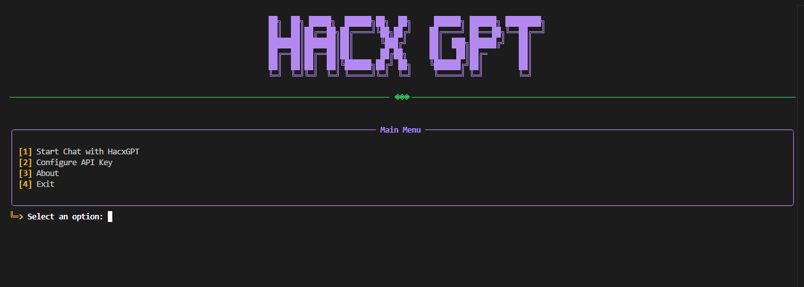

<div align="center">

  

  # HacxGPT

  <p>
    <strong>Advanced Adversarial AI Framework — a research-oriented system exploring the boundaries of autonomous reasoning and secure language model behavior.</strong>
  </p>

</div>

---

## 🧠 About The Project

**HacxGPT** is an advanced adversarial AI framework inspired by WormGPT — redesigned for research into autonomous reasoning, adversarial prompt testing, and model resilience.

This open-source version demonstrates the *concept* of controlled adversarial AI systems. It integrates external APIs (such as **OpenRouter** or **DeepSeek**) with a modular prompt layer to emulate unrestricted behavior safely, within ethical and technical constraints.

> **Note:** This repository contains a demonstration framework. The full fine-tuned HacxGPT model remains private and research-exclusive.

---


## ⚙️ Core Features

- **Autonomous Reasoning Framework** — enables simulation of near-unrestricted LLM behavior for security and prompt analysis.  
- **Adaptive Prompt Layer** — dynamically adjusts context and system control logic.  
- **Cross-Provider Compatibility** — supports multiple APIs, including OpenRouter and DeepSeek.  
- **Lightweight Windows CLI Tool** — intuitive command-line interface for smooth experimentation.  
- **Fully Optimized for Windows Systems.**

---

## 🚀 Showcase

A look at the interactive CLI environment of **HacxGPT**.



---
## **Note on Installation:** 
Windows & macOS users should refer to the manual guide. For a more straightforward process on macOS, download the [DMG file](../../releases).


## ⚡ Installation (Windows)

### 🧰 Prerequisites

1. **Install Python 3.10+**  
   👉 [Download from python.org](https://www.python.org/downloads/)

2. **Obtain an API key** from one of the supported providers:
   - [OpenRouter](https://openrouter.ai/keys)
   - [DeepSeek](https://platform.deepseek.com/api_keys)

3. **Download this repository** or clone it via Git:
   ```bash
   git clone https://github.com/setls/HacxGPT.git
   ```

---

### ⚙️ Quick Setup

1. Navigate into the project folder:
   ```bash
   cd HacxGPT
   ```

2. Install all dependencies:
   ```bash
   pip install -r requirements.txt
   ```

3. Run the installer:
   ```bash
   install.bat
   ```

4. Launch **HacxGPT**:
   ```bash
   python HacxGPT.py
   ```

> 💡 **Tip:** On first launch, you’ll be prompted to enter your API key.  
> It will be stored locally for your next sessions.

---

### 🧩 Configuration

To switch API providers, open the `HacxGPT.py` file and modify:

```python
API_PROVIDER = "openrouter"  # or "deepseek"
```

Save the file and restart the program.

---

### ⚠️ License

Distributed under the **MIT LICENSE**.  

---

<div align="center">
  <sub>© 2025 setls — All Rights Reserved</sub>
</div>